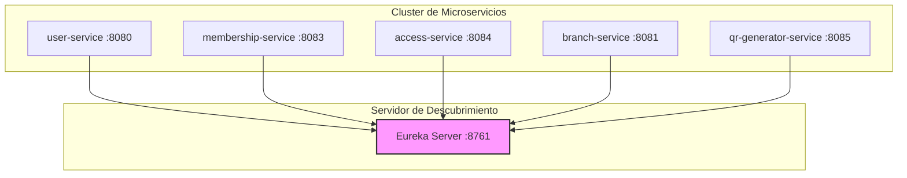

# 🏋️‍♂️ Evidencia de Aportes - Proyecto GymFlow
**Desarrollador:** Joaquín Sandoval  
**Rol en el Proyecto:** Arquitecto de Software & Desarrollador Backend Base  
**Tecnologías Clave:** Spring Boot, Spring Cloud (Eureka Server), OpenFeign, H2 Database, Spring Web, Java.

---

## 📌 Resumen del Aporte
Como desarrollador del backend de **GymFlow**, mi principal responsabilidad consistió en **diseñar, levantar y estructurar los cimientos de la arquitectura de microservicios**. Fui el encargado de codificar los esqueletos funcionales de los servicios clave del ecosistema, configurar el servidor de descubrimiento de servicios, y garantizar que la comunicación inter-servicio síncrona funcionara sin fricciones.

A continuación, se detallan de manera técnica los componentes de software desarrollados, las tecnologías implementadas y los flujos integrados bajo mi autoría.

---

## 🛠️ 1. Arquitectura de Microservicios & Descubrimiento (Service Discovery)

Diseñé y configuré el **Servidor de Descubrimiento (Service Discovery)** para registrar dinámicamente cada componente de la red distribuida, eliminando el acoplamiento físico por direcciones IP.

*   **Tecnología:** `Spring Cloud Netflix Eureka Server`
*   **Aporte:**
    *   Configuración del archivo de propiedades del servidor (`8761`).
    *   Habilitación del registro dinámico de múltiples microservicios concurrentes (incluyendo `user-service`, `membership-service`, `access-service`, `branch-service` y `qr-generator-service`).
    *   Verificación de la topología de red en tiempo real mediante el panel administrativo visual de Eureka.

---

## 💻 2. Desarrollo de Componentes Base & Lógica de Negocio

Lideré el diseño e implementación de los controladores, servicios y DTOs en los módulos críticos del backend, asegurando el desacoplamiento de datos de acuerdo a los patrones de diseño modernos.

### 👤 User Service (Puerto 8080)
*   **Desarrollo:** Diseñé los endpoints base para el control de identidad de clientes y personal administrativo.
*   **Patrón Implementado:** Implementación de Data Transfer Objects (`UserResponse` y `UserRequest`) para proteger la integridad de las entidades y evitar la exposición directa del modelo de persistencia.
*   **Estrategia de Testeo:** Creación de respuestas dinámicas controladas (*mocking*) en memoria para simular escenarios de prueba estables frente a contingencias en la base de datos de usuarios.

### 🏢 Branch Service (Puerto 8081)
*   **Desarrollo:** Creación de la API de gestión de sedes físicas e infraestructura del gimnasio.
*   **Modelo de Datos:** Implementación de la entidad base `Branch` mapeando atributos como `name`, `address` y `maxCapacity`.
*   **Configuración de Persistencia:** Configuración de generadores automáticos de IDs (`Auto-incremental`) y endpoints `POST` para la creación de sucursales en tiempo real y persistencia ligera.

---

## 🔗 3. Comunicación Inter-Servicio & Orquestación de Acceso

El mayor desafío técnico resuelto fue conectar la lógica de negocios del gimnasio mediante llamadas remotas altamente cohesivas.

[Postman Client] --(POST)--> [Access Service: 8084]
|
|-- (OpenFeign Client) --> [Membership Service: 8083]
|
v
[QR Generator: 8085] --(Base64)--> [Respuesta Exitosa 201]

### 🚪 Access Service (Puerto 8084) & OpenFeign
*   **Integración Síncrona:** Implementé **Spring Cloud OpenFeign** para conectar de manera reactiva el flujo del torniquete electrónico con la base de datos distribuida en el servicio de membresías (`membership-service`).
*   **Lógica de Acceso:** 
    1.  El torniquete recibe la solicitud (`userId`, `branchId`).
    2.  Consulta mediante cliente REST declarativo si el contrato del usuario está en estado **`ACTIVA`**.
    3.  Al validar las reglas de negocio, se asocia el pase correspondiente y se genera un token UUID para el acceso.

### 📷 QR Generator Service (Puerto 8085)
*   **Procesamiento Binario:** Diseñé la ruta base `/api/qr/create` encargada de recibir el identificador de acceso y el token de contenido.
*   **Optimización de Red:** Configuré el microservicio para que procese el contenido del QR y devuelva la imagen serializada en formato **`Base64`** dentro de una trama JSON. Esto evita la transferencia pesada de archivos multimedia (bytes crudos) a través del canal HTTP.

---

## 🔍 4. Flujo de Pruebas e Integración de Datos (Postman)

Para garantizar la estabilidad del sistema y respaldar la defensa del proyecto, diseñé una suite de pruebas controladas a nivel local utilizando bases de datos en memoria (`H2 Database`):

1.  **GET `/api/users`:** Recuperación síncrona de información de clientes encapsulados en DTOs.
2.  **POST `/api/access/generate`:** Orquestación y verificación de contratos de membresía a través de la red de microservicios con salida en estado `PENDIENTE`.
3.  **POST `/api/qr/create`:** Entrada de metadatos y conversión exitosa de tokens en strings Base64 decodificables en imágenes PNG de códigos QR reales.
4.  **GET `/api/branches`:** Consulta en vivo de catálogos y sucursales físicas creadas de forma dinámica en base de datos.

## 🗺️ 5. Diagramas de Arquitectura y Flujo de Datos

### Topología de Microservicios (Eureka Discovery)
Este diagrama muestra cómo todos los servicios de la red que levanté se registran dinámicamente en el servidor de descubrimiento para comunicarse entre sí:

###Flujo de Generación de Acceso y QR (Orquestación Síncrona)
##Este es el camino exacto que recorre la información cuando el usuario pasa por el torniquete electrónico, 
aplicando la comunicación por cliente REST declarativo (Feign Client) y la serialización binaria:

sequenceDiagram
    autonumber
    actor Cliente as Postman / Cliente
    participant AS as Access Service (:8084)
    participant MS as Membership Service (:8083)
    participant QR as QR Generator (:8085)

    Cliente->>AS: POST /api/access/generate (userId, branchId)
    Note over AS,MS: Comunicación Síncrona vía OpenFeign
    AS->>MS: GET /api/memberships (Verificar Estado de Contrato)
    MS-->>AS: Retorna Estado: 'ACTIVA' [Filtro de Seguridad]
    
    Note over AS,QR: Generación y Serialización de QR
    AS->>QR: POST /api/qr/create (accessTokenId, contenido UUID)
    QR->>QR: Codifica Token a Imagen Base64
    QR-->>AS: Retorna JSON con Imagen en Base64
    
    AS-->>Cliente: Retorna Acceso 'PENDIENTE' con QR en Base64 (201 Created)
